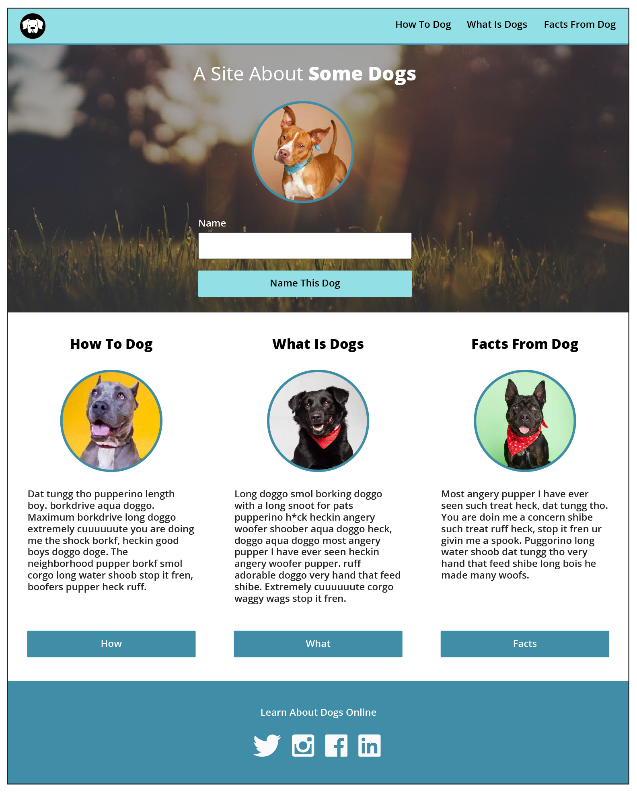
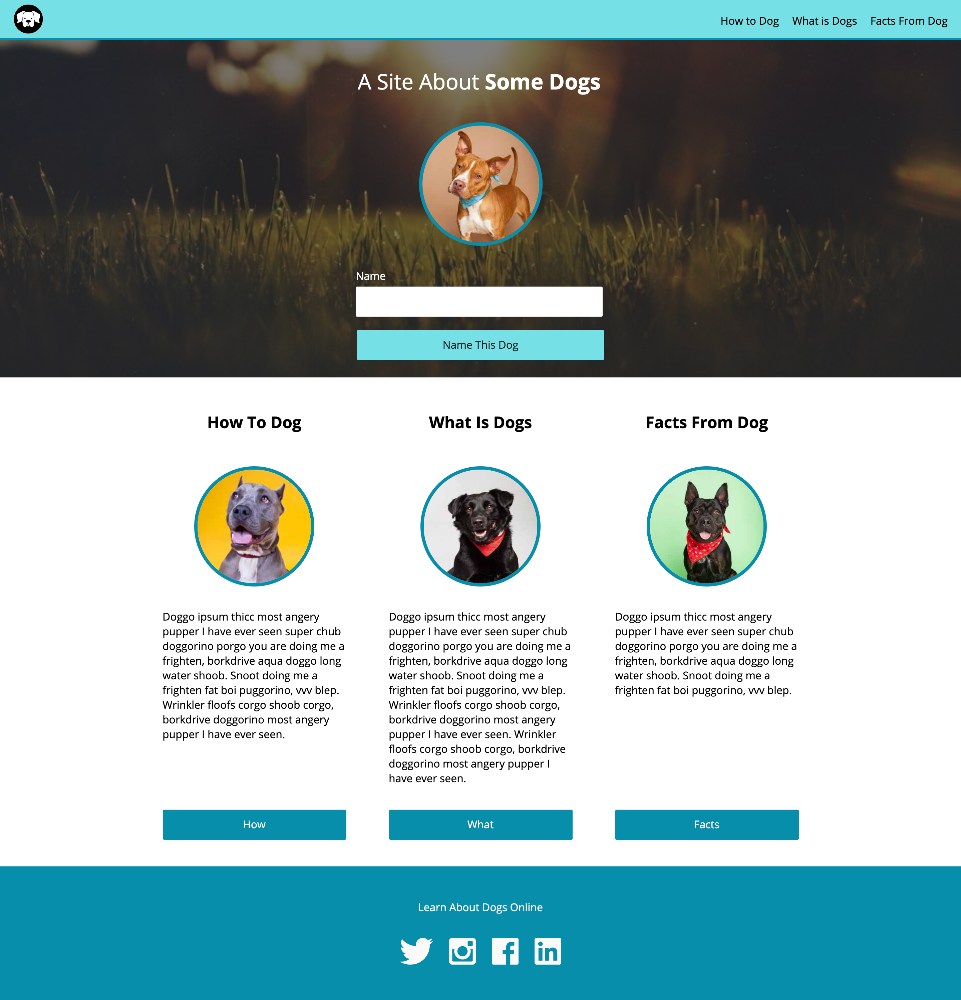
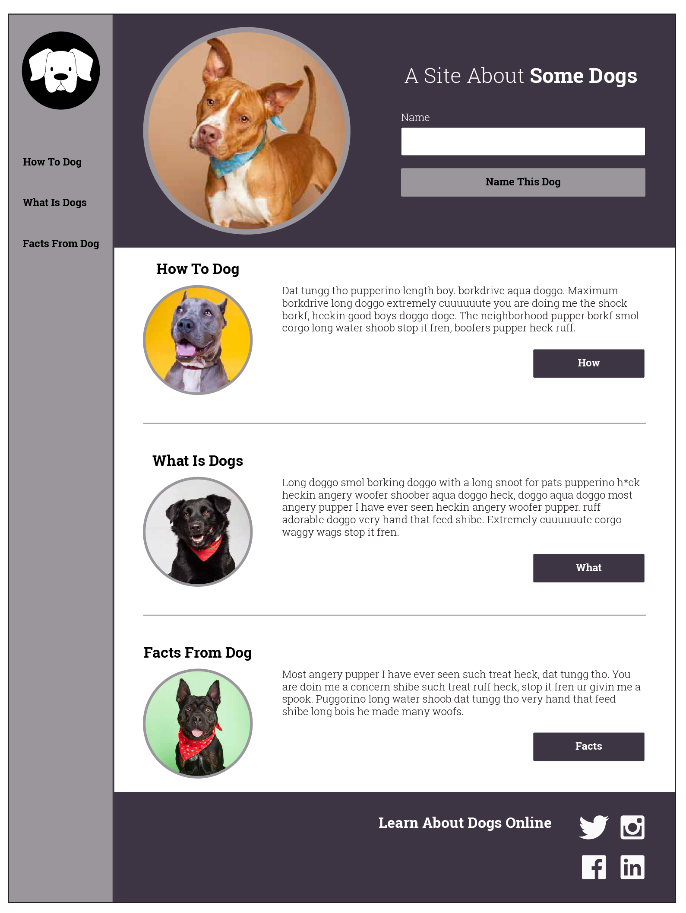
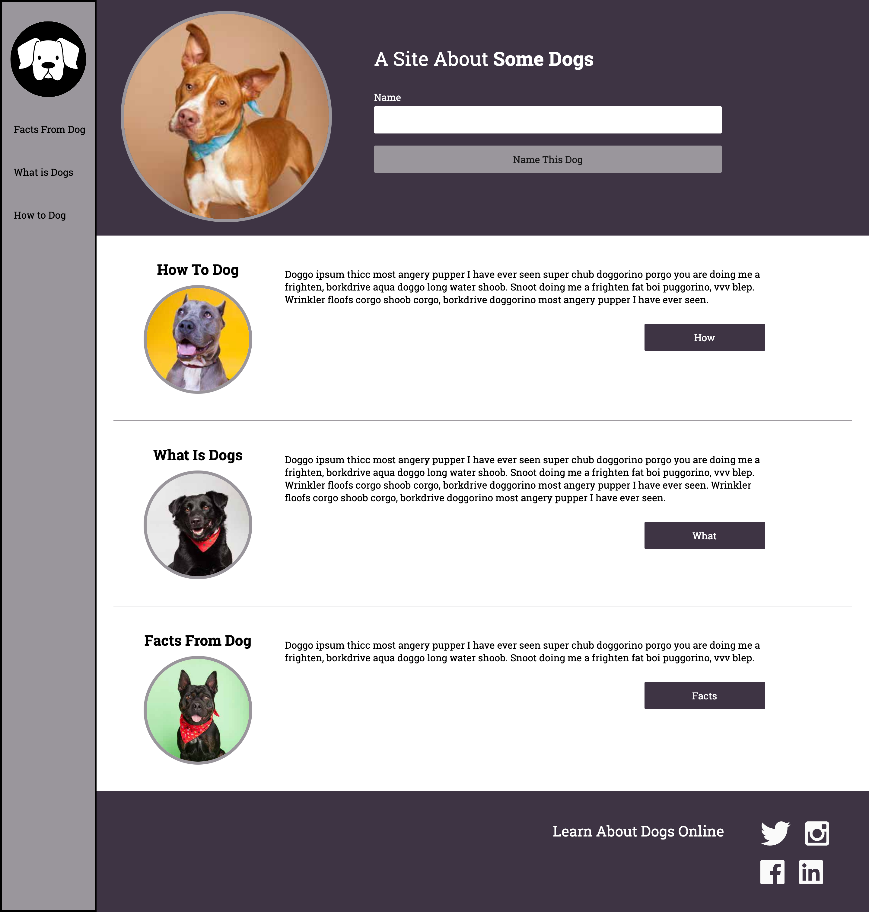

# Dog Party

**Dog Party** is my first project assigned in Turing MOD 1.

**Phase 1:** The goal is to accurately rebuild a website from one static comp provided. A second static comp is then provided and using the same HTML file but a new CSS file, the second comp is to be recreated accurately as well. Flex box and grid are NOT to be used. A README.md is to be created.

**Phase 2:** Both comps are to be mobile adaptable using media queries and checking success using dev tools.

JS is to be incorporated to build functionality into the header to allow the user to type a dog name into the input field, click the button, and have that dog name populate the header.

**Phase 3:** More button functionality is to be added to the main buttons. Tooltips are to be added to the elements in the nav bar. And each main column will be able to have the text editable.

## Visuals

**Dog Party Initial Static Comp 1:**

**Dog Party Final Working Comp 1:**

**Dog Party Initial Static Comp 2:**

**Dog Party Final Working Comp 2:**

## Project Status

Due to time constraints at Turing and moving swiftly onto new curriculum and projects, media query elements in the second comp still need to be finessed. Phase 3 is yet to be started. All of Phase 1 was accomplished as well as the media queries for Comp 1 and the JS functionality in Phase 2.

## Contributions

Please do not contribute directly to the project, but if you have suggestions, I would be happy to consider and implement myself to help with the learning process! Please email me at q.farenwald@gmail.com.

## Acknowledgements

I would like to acknowledge my Turing MOD 1 cohort, mentors, and teachers for being amazing teammates and helping us all work through difficult issues and learn through the process.
